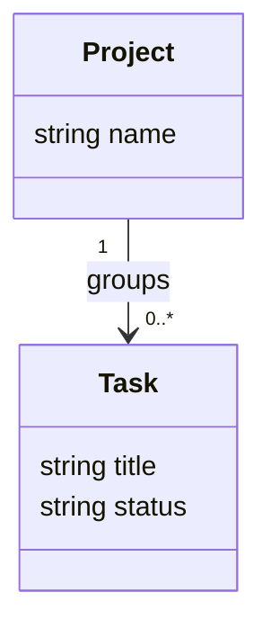
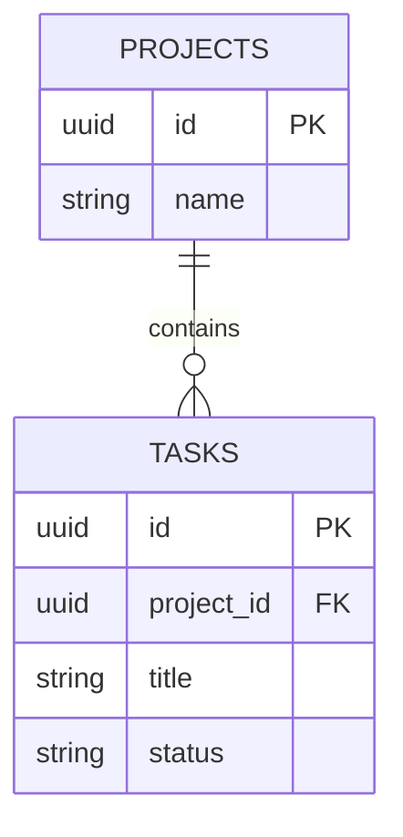
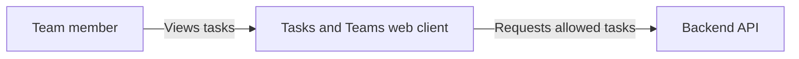
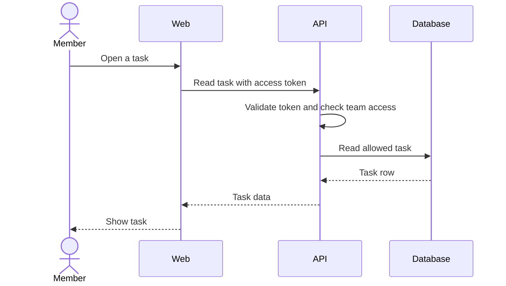
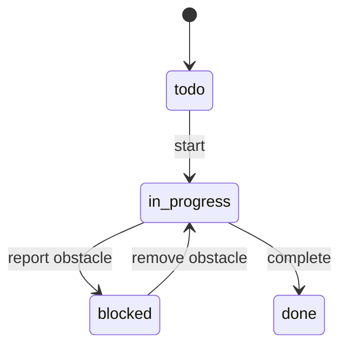

# Diagram source listings

These listings reproduce the editable diagram sources in this folder.

## class.mmd

```mermaid
classDiagram
  class Project {
    string name
  }
  class Task {
    string title
    string status
  }
  Project "1" --> "0..*" Task : groups
```

## er.mmd

```mermaid
erDiagram
  PROJECTS ||--o{ TASKS : contains
  PROJECTS {
    uuid id PK
    string name
  }
  TASKS {
    uuid id PK
    uuid project_id FK
    string title
    string status
  }
```

## flow.mmd

```mermaid
flowchart LR
  member["Team member"]
  web["Tasks and Teams web client"]
  api["Backend API"]
  member -->|"Views tasks"| web
  web -->|"Requests allowed tasks"| api
```

## sequence.mmd

```mermaid
sequenceDiagram
  actor Member
  participant Web
  participant API
  participant Database
  Member->>Web: Open a task
  Web->>API: Read task with access token
  API->>API: Validate token and check team access
  API->>Database: Read allowed task
  Database-->>API: Task row
  API-->>Web: Task data
  Web-->>Member: Show task
```

## state.mmd

```mermaid
stateDiagram-v2
  [*] --> todo
  todo --> in_progress : start
  in_progress --> blocked : report obstacle
  blocked --> in_progress : remove obstacle
  in_progress --> done : complete
```
