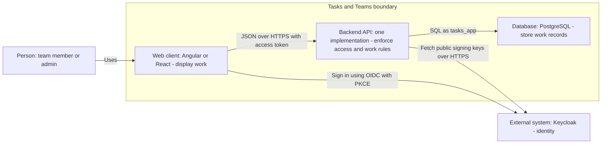
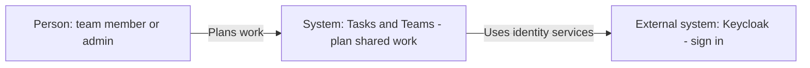
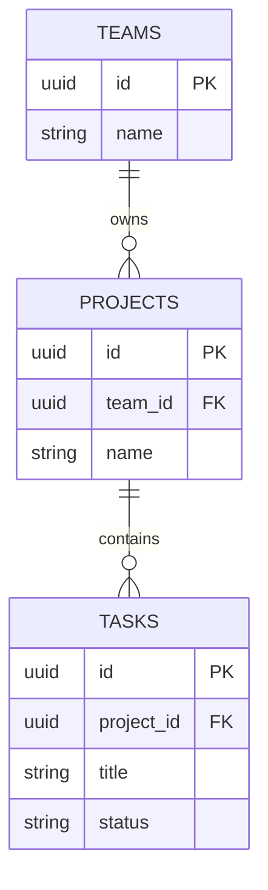
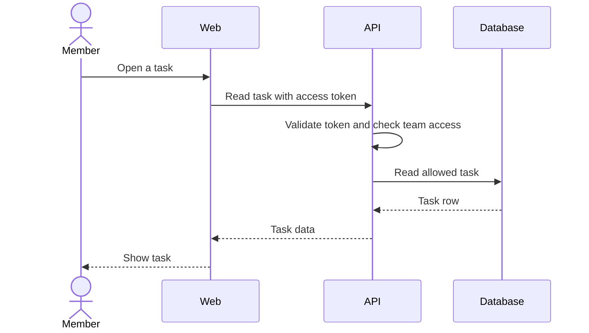

# Diagram source listings

These listings reproduce the editable diagram sources in this folder.

## containers.mmd

```mermaid
flowchart LR
  person["Person: team member or admin"]
  identity["External system: Keycloak - identity"]
  subgraph platform["Tasks and Teams boundary"]
    web["Web client: Angular or React - display work"]
    api["Backend API: one implementation - enforce access and work rules"]
    db["Database: PostgreSQL - store work records"]
  end
  person -->|"Uses"| web
  web -->|"Sign in using OIDC with PKCE"| identity
  web -->|"JSON over HTTPS with access token"| api
  api -->|"SQL as tasks_app"| db
  api -->|"Fetch public signing keys over HTTPS"| identity
```

## context.mmd

```mermaid
flowchart LR
  person["Person: team member or admin"]
  platform["System: Tasks and Teams - plan shared work"]
  identity["External system: Keycloak - sign in"]
  person -->|"Plans work"| platform
  platform -->|"Uses identity services"| identity
```

## data.mmd

```mermaid
erDiagram
  TEAMS ||--o{ PROJECTS : owns
  PROJECTS ||--o{ TASKS : contains
  TEAMS {
    uuid id PK
    string name
  }
  PROJECTS {
    uuid id PK
    uuid team_id FK
    string name
  }
  TASKS {
    uuid id PK
    uuid project_id FK
    string title
    string status
  }
```

## sequence.mmd

```mermaid
sequenceDiagram
  actor Member
  participant Web
  participant API
  participant Database
  Member->>Web: Open a task
  Web->>API: Read task with access token
  API->>API: Validate token and check team access
  API->>Database: Read allowed task
  Database-->>API: Task row
  API-->>Web: Task data
  Web-->>Member: Show task
```
