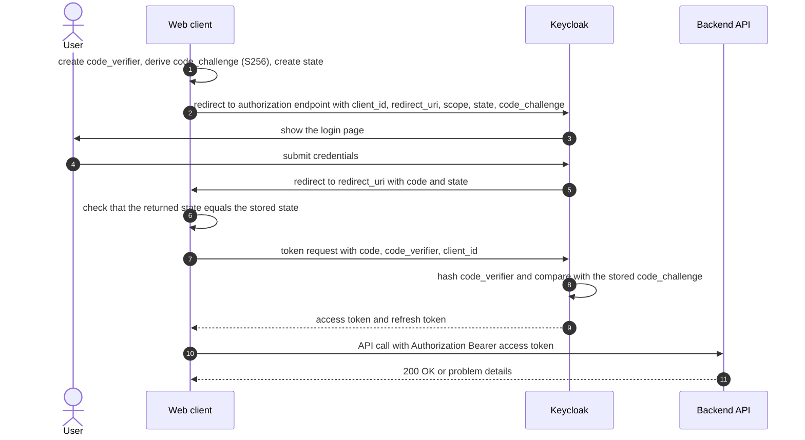
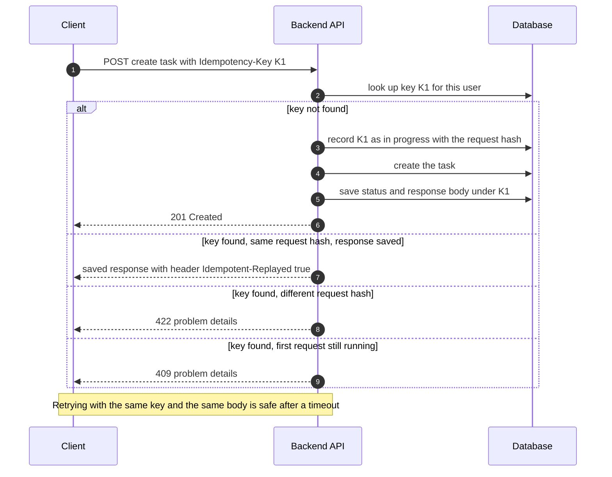

# Diagram sources, lesson 01

Each fenced block is the content of the .mmd file named above it.

**File: `signin-pkce.mmd`**

```mermaid
sequenceDiagram
    autonumber
    actor U as User
    participant W as Web client
    participant K as Keycloak
    participant A as Backend API
    W->>W: create code_verifier, derive code_challenge (S256), create state
    W->>K: redirect to authorization endpoint with client_id, redirect_uri, scope, state, code_challenge
    K->>U: show the login page
    U->>K: submit credentials
    K->>W: redirect to redirect_uri with code and state
    W->>W: check that the returned state equals the stored state
    W->>K: token request with code, code_verifier, client_id
    K->>K: hash code_verifier and compare with the stored code_challenge
    K-->>W: access token and refresh token
    W->>A: API call with Authorization Bearer access token
    A-->>W: 200 OK or problem details
```

**File: `idempotent-create.mmd`**

```mermaid
sequenceDiagram
    autonumber
    participant C as Client
    participant A as Backend API
    participant D as Database
    C->>A: POST create task with Idempotency-Key K1
    A->>D: look up key K1 for this user
    alt key not found
        A->>D: record K1 as in progress with the request hash
        A->>D: create the task
        A->>D: save status and response body under K1
        A-->>C: 201 Created
    else key found, same request hash, response saved
        A-->>C: saved response with header Idempotent-Replayed true
    else key found, different request hash
        A-->>C: 422 problem details
    else key found, first request still running
        A-->>C: 409 problem details
    end
    Note over C,A: Retrying with the same key and the same body is safe after a timeout
```
