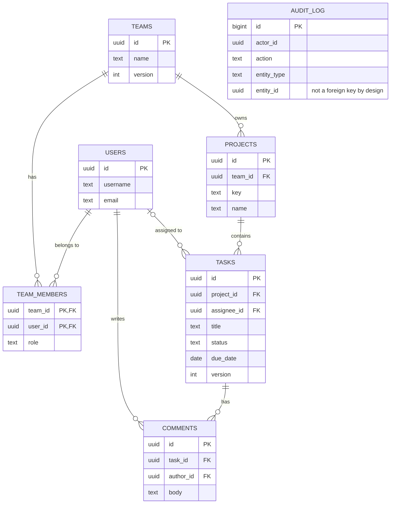
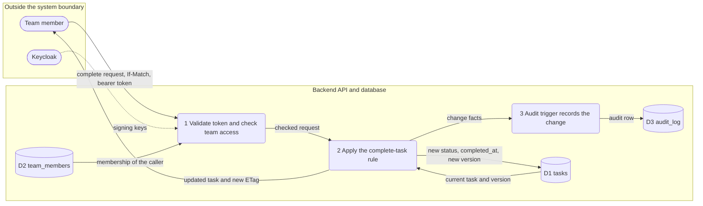

# Diagram sources, lesson 02

Each fenced block is the content of the .mmd file named above it.

**File: `tasks-er.mmd`**

```mermaid
erDiagram
    USERS ||--o{ TEAM_MEMBERS : "belongs to"
    TEAMS ||--o{ TEAM_MEMBERS : has
    TEAMS ||--o{ PROJECTS : owns
    PROJECTS ||--o{ TASKS : contains
    USERS |o--o{ TASKS : "assigned to"
    TASKS ||--o{ COMMENTS : has
    USERS ||--o{ COMMENTS : writes
    USERS {
        uuid id PK
        text username
        text email
    }
    TEAMS {
        uuid id PK
        text name
        int version
    }
    TEAM_MEMBERS {
        uuid team_id PK, FK
        uuid user_id PK, FK
        text role
    }
    PROJECTS {
        uuid id PK
        uuid team_id FK
        text key
        text name
    }
    TASKS {
        uuid id PK
        uuid project_id FK
        uuid assignee_id FK
        text title
        text status
        date due_date
        int version
    }
    COMMENTS {
        uuid id PK
        uuid task_id FK
        uuid author_id FK
        text body
    }
    AUDIT_LOG {
        bigint id PK
        uuid actor_id
        text action
        text entity_type
        uuid entity_id "not a foreign key by design"
    }
```

**File: `dataflow-complete-task.mmd`**

```mermaid
flowchart LR
    subgraph Outside["Outside the system boundary"]
        U(["Team member"])
        KC(["Keycloak"])
    end
    subgraph Inside["Backend API and database"]
        P1("1 Validate token and check team access")
        P2("2 Apply the complete-task rule")
        P3("3 Audit trigger records the change")
        D1[("D1 tasks")]
        D2[("D2 team_members")]
        D3[("D3 audit_log")]
    end
    U -->|"complete request, If-Match, bearer token"| P1
    KC -.->|"signing keys"| P1
    D2 -->|"membership of the caller"| P1
    P1 -->|"checked request"| P2
    D1 -->|"current task and version"| P2
    P2 -->|"new status, completed_at, new version"| D1
    P2 -->|"change facts"| P3
    P3 -->|"audit row"| D3
    P2 -->|"updated task and new ETag"| U
```
