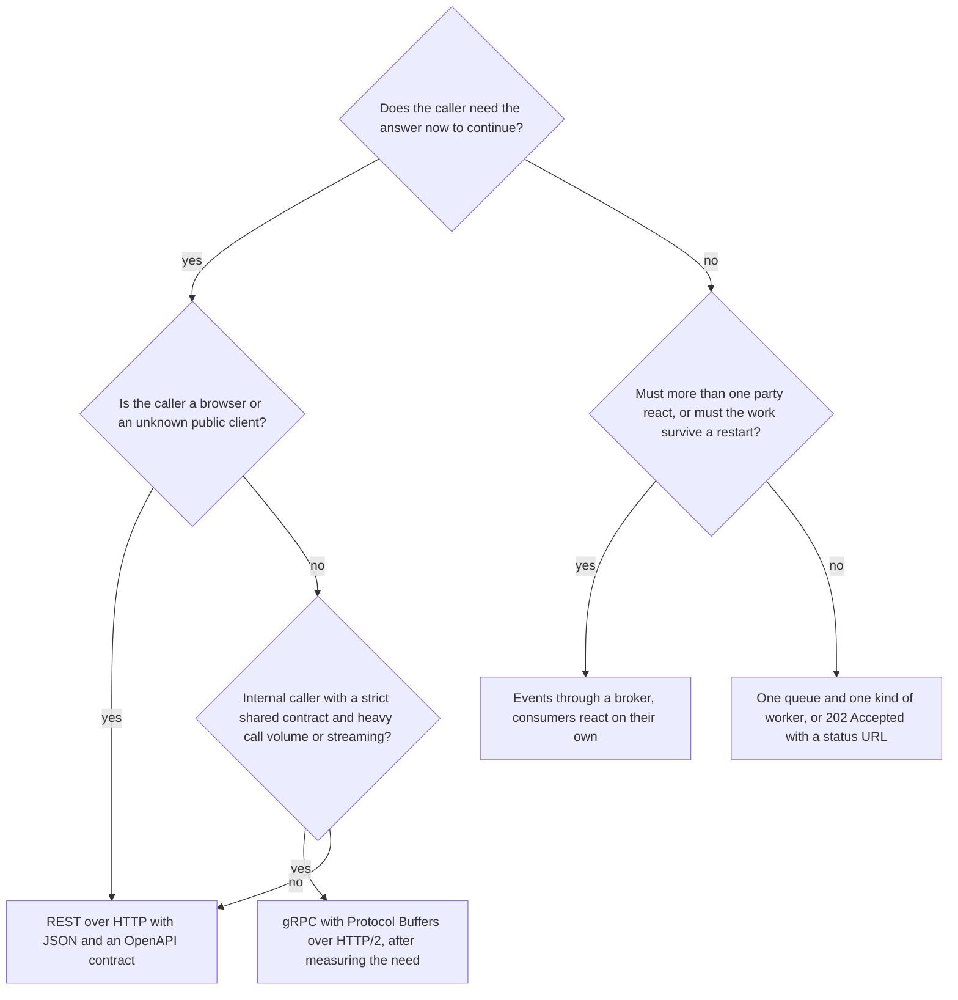
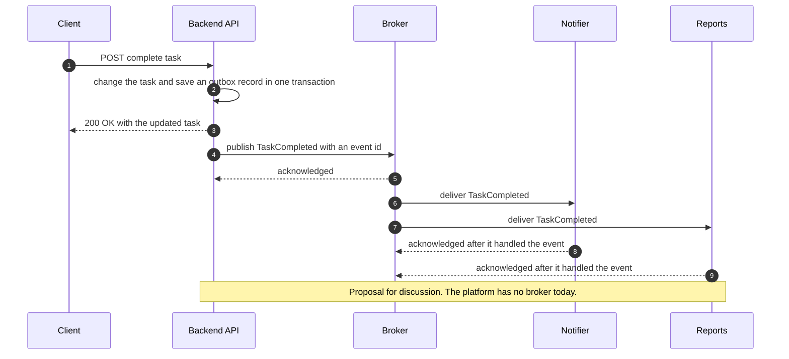

# Diagram sources, lesson 04

Each fenced block is the content of the .mmd file named above it.

**File: `style-chooser.mmd`**

```mermaid
flowchart TD
    Q1{"Does the caller need the answer now to continue?"}
    Q2{"Is the caller a browser or an unknown public client?"}
    Q3{"Internal caller with a strict shared contract and heavy call volume or streaming?"}
    Q4{"Must more than one party react, or must the work survive a restart?"}
    REST["REST over HTTP with JSON and an OpenAPI contract"]
    GRPC["gRPC with Protocol Buffers over HTTP/2, after measuring the need"]
    EVT["Events through a broker, consumers react on their own"]
    JOB["One queue and one kind of worker, or 202 Accepted with a status URL"]
    Q1 -->|"yes"| Q2
    Q1 -->|"no"| Q4
    Q2 -->|"yes"| REST
    Q2 -->|"no"| Q3
    Q3 -->|"yes"| GRPC
    Q3 -->|"no"| REST
    Q4 -->|"yes"| EVT
    Q4 -->|"no"| JOB
```

**File: `task-completed-events.mmd`**

```mermaid
sequenceDiagram
    autonumber
    participant C as Client
    participant A as Backend API
    participant B as Broker
    participant N as Notifier
    participant R as Reports
    C->>A: POST complete task
    A->>A: change the task and save an outbox record in one transaction
    A-->>C: 200 OK with the updated task
    A->>B: publish TaskCompleted with an event id
    B-->>A: acknowledged
    B->>N: deliver TaskCompleted
    B->>R: deliver TaskCompleted
    N-->>B: acknowledged after it handled the event
    R-->>B: acknowledged after it handled the event
    Note over A,R: Proposal for discussion. The platform has no broker today.
```
