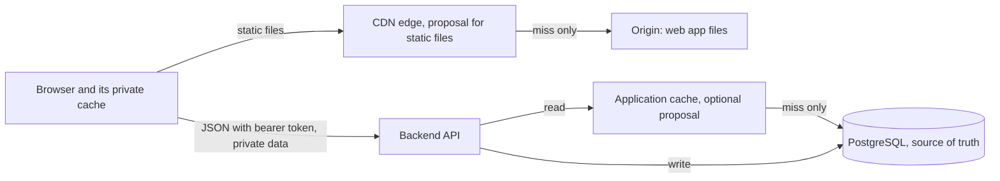
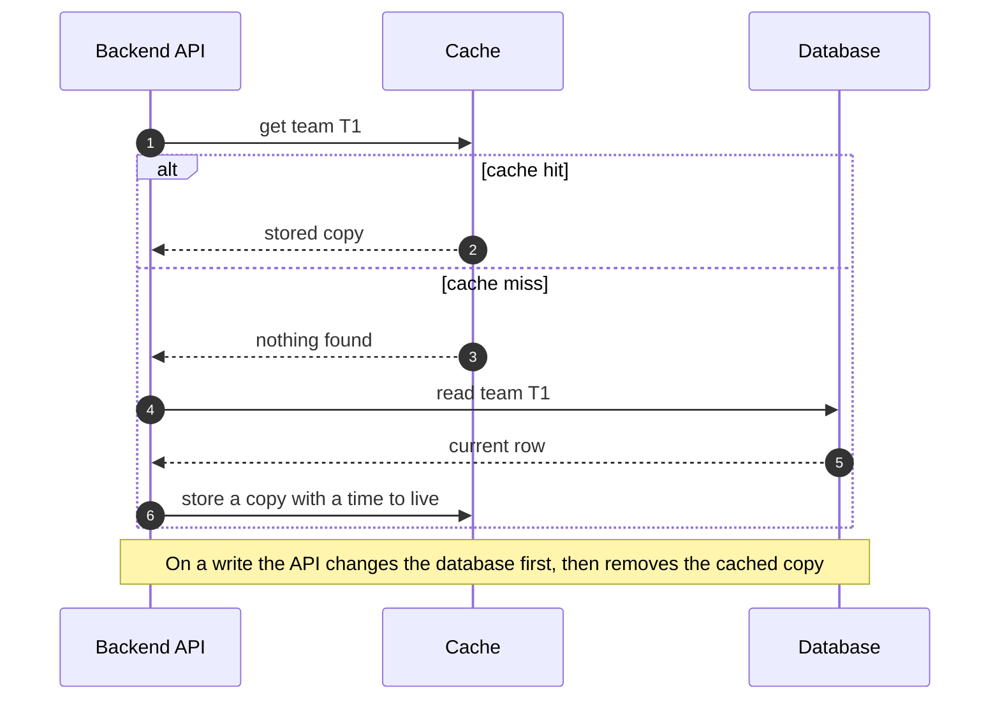
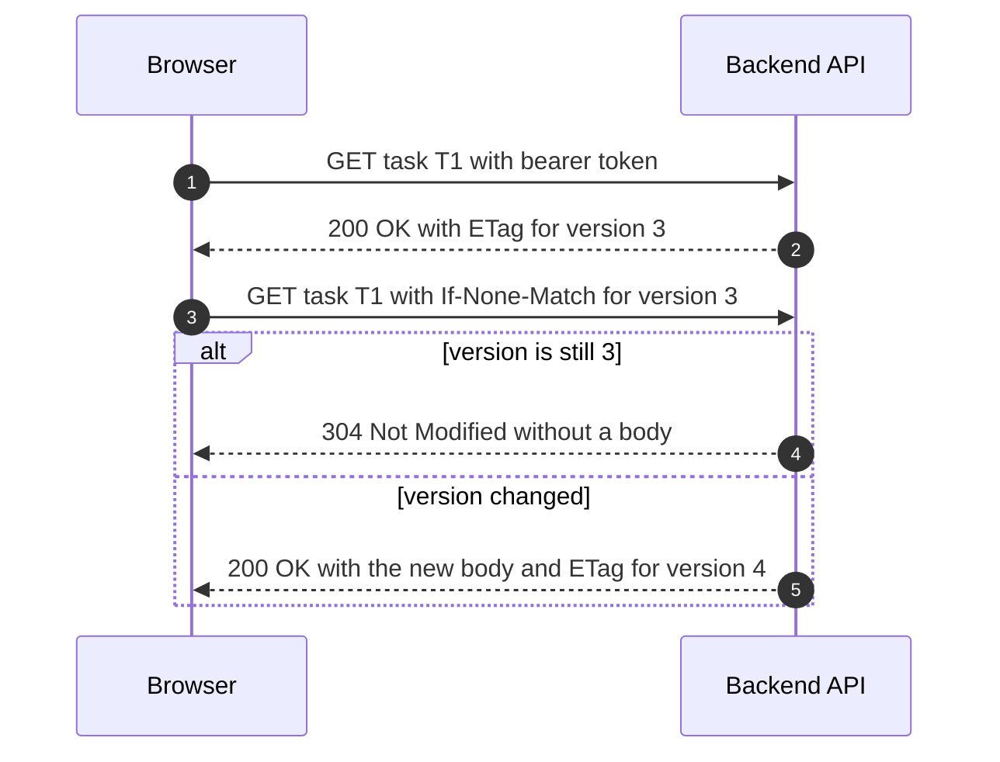

# Diagram sources, lesson 05

Each fenced block is the content of the .mmd file named above it.

**File: `cache-layers.mmd`**

```mermaid
flowchart LR
    B["Browser and its private cache"]
    CDN["CDN edge, proposal for static files"]
    ORI["Origin: web app files"]
    API["Backend API"]
    AC["Application cache, optional proposal"]
    DB[("PostgreSQL, source of truth")]
    B -->|"static files"| CDN
    CDN -->|"miss only"| ORI
    B -->|"JSON with bearer token, private data"| API
    API -->|"read"| AC
    AC -->|"miss only"| DB
    API -->|"write"| DB
```

**File: `cache-aside.mmd`**

```mermaid
sequenceDiagram
    autonumber
    participant A as Backend API
    participant K as Cache
    participant D as Database
    A->>K: get team T1
    alt cache hit
        K-->>A: stored copy
    else cache miss
        K-->>A: nothing found
        A->>D: read team T1
        D-->>A: current row
        A->>K: store a copy with a time to live
    end
    Note over A,D: On a write the API changes the database first, then removes the cached copy
```

**File: `conditional-get.mmd`**

```mermaid
sequenceDiagram
    autonumber
    participant B as Browser
    participant A as Backend API
    B->>A: GET task T1 with bearer token
    A-->>B: 200 OK with ETag for version 3
    B->>A: GET task T1 with If-None-Match for version 3
    alt version is still 3
        A-->>B: 304 Not Modified without a body
    else version changed
        A-->>B: 200 OK with the new body and ETag for version 4
    end
```
