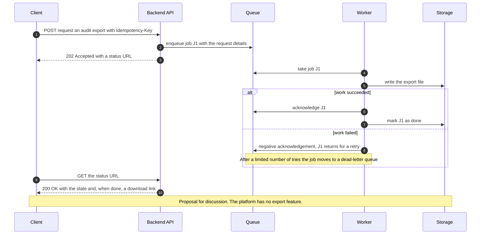
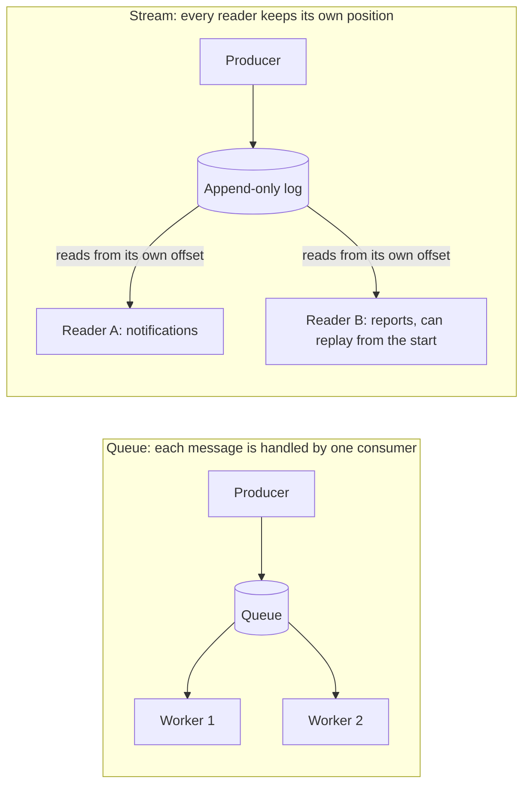
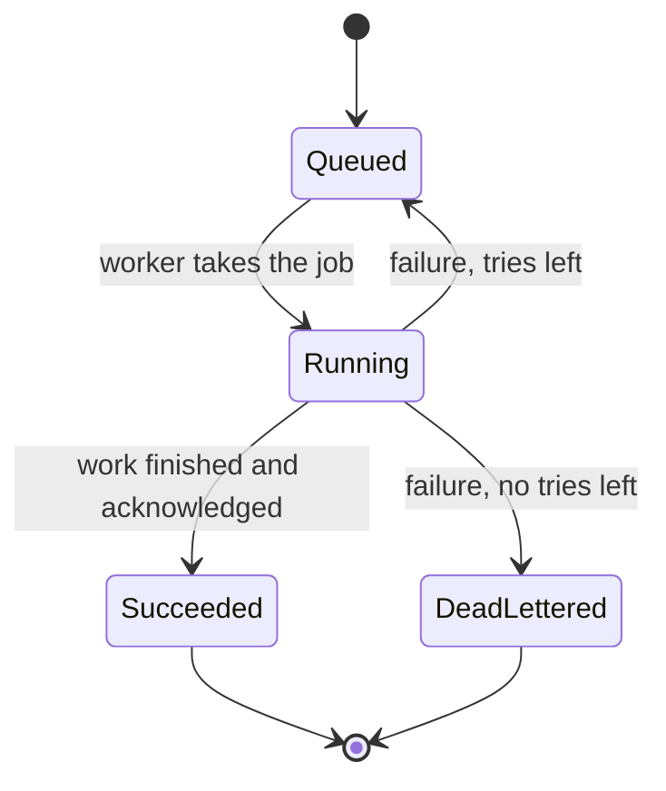

# Diagram sources, lesson 06

Each fenced block is the content of the .mmd file named above it.

**File: `async-export.mmd`**

```mermaid
sequenceDiagram
    autonumber
    participant C as Client
    participant A as Backend API
    participant Q as Queue
    participant W as Worker
    participant S as Storage
    C->>A: POST request an audit export with Idempotency-Key
    A->>Q: enqueue job J1 with the request details
    A-->>C: 202 Accepted with a status URL
    W->>Q: take job J1
    W->>S: write the export file
    alt work succeeded
        W->>Q: acknowledge J1
        W->>S: mark J1 as done
    else work failed
        W->>Q: negative acknowledgement, J1 returns for a retry
        Note over W,Q: After a limited number of tries the job moves to a dead-letter queue
    end
    C->>A: GET the status URL
    A-->>C: 200 OK with the state and, when done, a download link
    Note over C,S: Proposal for discussion. The platform has no export feature.
```

**File: `queue-vs-stream.mmd`**

```mermaid
flowchart LR
    subgraph QueueStyle["Queue: each message is handled by one consumer"]
        P1["Producer"] --> Q1[("Queue")]
        Q1 --> W1["Worker 1"]
        Q1 --> W2["Worker 2"]
    end
    subgraph StreamStyle["Stream: every reader keeps its own position"]
        P2["Producer"] --> L1[("Append-only log")]
        L1 -->|"reads from its own offset"| R1["Reader A: notifications"]
        L1 -->|"reads from its own offset"| R2["Reader B: reports, can replay from the start"]
    end
```

**File: `job-state.mmd`**

```mermaid
stateDiagram-v2
    [*] --> Queued
    Queued --> Running : worker takes the job
    Running --> Succeeded : work finished and acknowledged
    Running --> Queued : failure, tries left
    Running --> DeadLettered : failure, no tries left
    Succeeded --> [*]
    DeadLettered --> [*]
```
