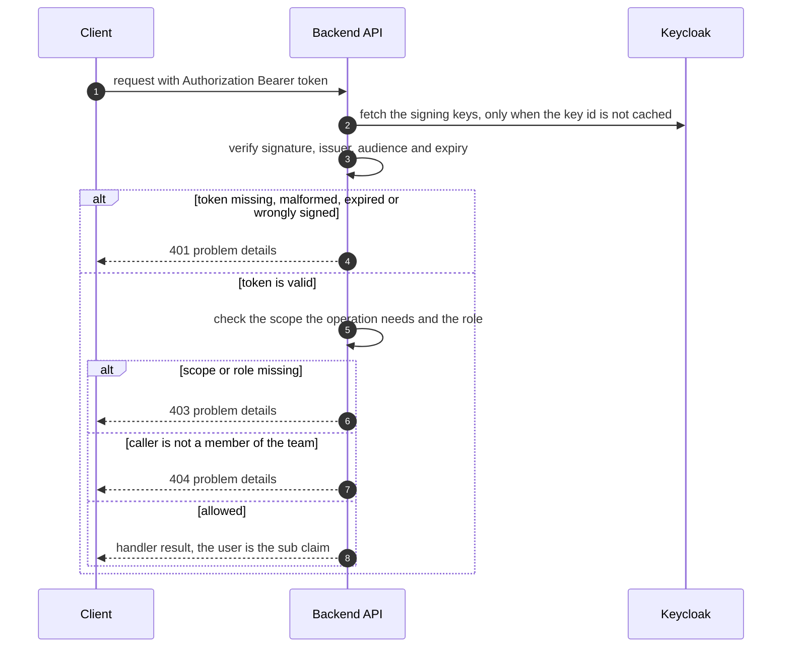
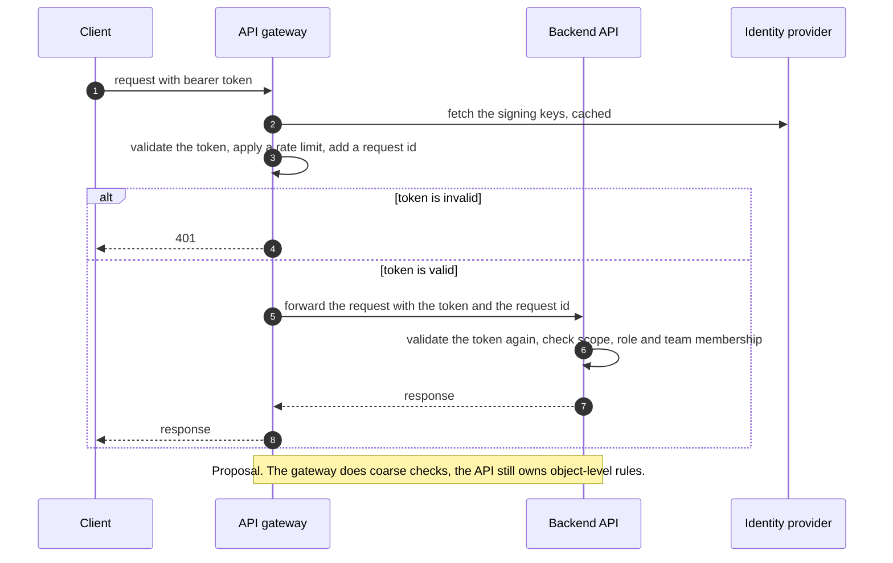
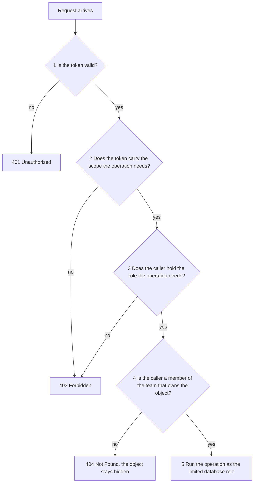

# Diagram sources, lesson 07

Each fenced block is the content of the .mmd file named above it.

**File: `token-validation.mmd`**

```mermaid
sequenceDiagram
    autonumber
    participant C as Client
    participant A as Backend API
    participant K as Keycloak
    C->>A: request with Authorization Bearer token
    A->>K: fetch the signing keys, only when the key id is not cached
    A->>A: verify signature, issuer, audience and expiry
    alt token missing, malformed, expired or wrongly signed
        A-->>C: 401 problem details
    else token is valid
        A->>A: check the scope the operation needs and the role
        alt scope or role missing
            A-->>C: 403 problem details
        else caller is not a member of the team
            A-->>C: 404 problem details
        else allowed
            A-->>C: handler result, the user is the sub claim
        end
    end
```

**File: `gateway-variant.mmd`**

```mermaid
sequenceDiagram
    autonumber
    participant C as Client
    participant G as API gateway
    participant A as Backend API
    participant K as Identity provider
    C->>G: request with bearer token
    G->>K: fetch the signing keys, cached
    G->>G: validate the token, apply a rate limit, add a request id
    alt token is invalid
        G-->>C: 401
    else token is valid
        G->>A: forward the request with the token and the request id
        A->>A: validate the token again, check scope, role and team membership
        A-->>G: response
        G-->>C: response
    end
    Note over G,A: Proposal. The gateway does coarse checks, the API still owns object-level rules.
```

**File: `authz-layers.mmd`**

```mermaid
flowchart TD
    R["Request arrives"]
    D1{"1 Is the token valid?"}
    D2{"2 Does the token carry the scope the operation needs?"}
    D3{"3 Does the caller hold the role the operation needs?"}
    D4{"4 Is the caller a member of the team that owns the object?"}
    OK["5 Run the operation as the limited database role"]
    E401["401 Unauthorized"]
    E403["403 Forbidden"]
    E404["404 Not Found, the object stays hidden"]
    R --> D1
    D1 -->|"no"| E401
    D1 -->|"yes"| D2
    D2 -->|"no"| E403
    D2 -->|"yes"| D3
    D3 -->|"no"| E403
    D3 -->|"yes"| D4
    D4 -->|"no"| E404
    D4 -->|"yes"| OK
```
