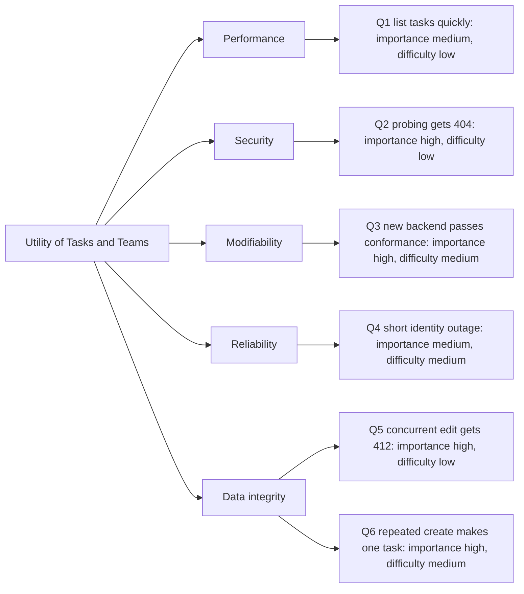

# Diagram sources, lesson 09

Each fenced block is the content of the .mmd file named above it.

**File: `utility-tree.mmd`**

```mermaid
flowchart LR
    U["Utility of Tasks and Teams"]
    P["Performance"]
    S["Security"]
    M["Modifiability"]
    R["Reliability"]
    C["Data integrity"]
    Q1["Q1 list tasks quickly: importance medium, difficulty low"]
    Q2["Q2 probing gets 404: importance high, difficulty low"]
    Q3["Q3 new backend passes conformance: importance high, difficulty medium"]
    Q4["Q4 short identity outage: importance medium, difficulty medium"]
    Q5["Q5 concurrent edit gets 412: importance high, difficulty low"]
    Q6["Q6 repeated create makes one task: importance high, difficulty medium"]
    U --> P
    U --> S
    U --> M
    U --> R
    U --> C
    P --> Q1
    S --> Q2
    M --> Q3
    R --> Q4
    C --> Q5
    C --> Q6
```
