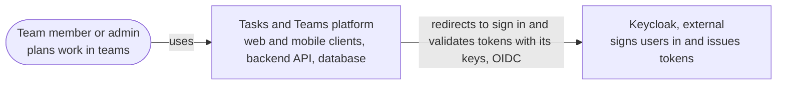
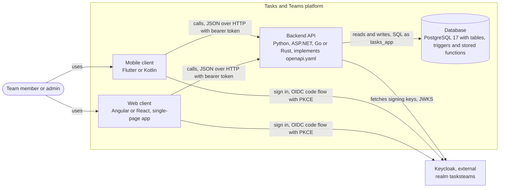
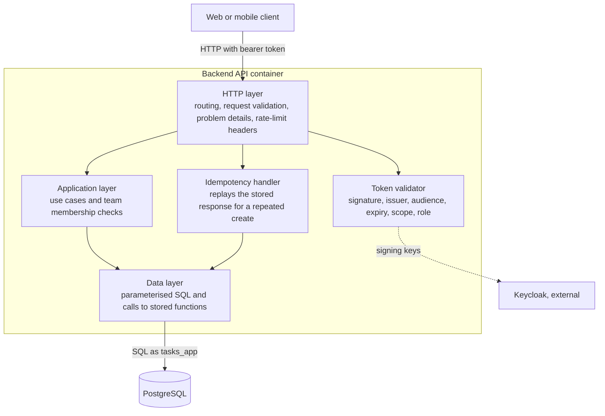

# Diagram sources, lesson 10

Each fenced block is the content of the .mmd file named above it.

**File: `context.mmd`**

```mermaid
flowchart LR
    user(["Team member or admin<br/>plans work in teams"])
    sys["Tasks and Teams platform<br/>web and mobile clients, backend API, database"]
    kc["Keycloak, external<br/>signs users in and issues tokens"]
    user -->|"uses"| sys
    sys -->|"redirects to sign in and validates tokens with its keys, OIDC"| kc
```

**File: `containers.mmd`**

```mermaid
flowchart LR
    user(["Team member or admin"])
    subgraph platform["Tasks and Teams platform"]
        web["Web client<br/>Angular or React, single-page app"]
        mob["Mobile client<br/>Flutter or Kotlin"]
        api["Backend API<br/>Python, ASP.NET, Go or Rust, implements openapi.yaml"]
        db[("Database<br/>PostgreSQL 17 with tables, triggers and stored functions")]
    end
    kc["Keycloak, external<br/>realm tasksteams"]
    user -->|"uses"| web
    user -->|"uses"| mob
    web -->|"sign in, OIDC code flow with PKCE"| kc
    mob -->|"sign in, OIDC code flow with PKCE"| kc
    web -->|"calls, JSON over HTTP with bearer token"| api
    mob -->|"calls, JSON over HTTP with bearer token"| api
    api -->|"reads and writes, SQL as tasks_app"| db
    api -->|"fetches signing keys, JWKS"| kc
```

**File: `components-backend.mmd`**

```mermaid
flowchart TD
    client["Web or mobile client"]
    subgraph api["Backend API container"]
        http["HTTP layer<br/>routing, request validation, problem details, rate-limit headers"]
        auth["Token validator<br/>signature, issuer, audience, expiry, scope, role"]
        idem["Idempotency handler<br/>replays the stored response for a repeated create"]
        app["Application layer<br/>use cases and team membership checks"]
        data["Data layer<br/>parameterised SQL and calls to stored functions"]
    end
    kc["Keycloak, external"]
    db[("PostgreSQL")]
    client -->|"HTTP with bearer token"| http
    http --> auth
    http --> idem
    http --> app
    app --> data
    idem --> data
    auth -.->|"signing keys"| kc
    data -->|"SQL as tasks_app"| db
```
