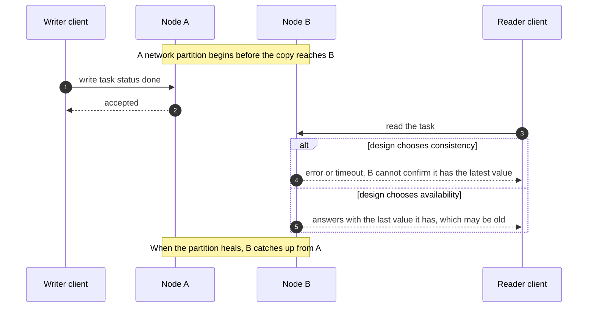
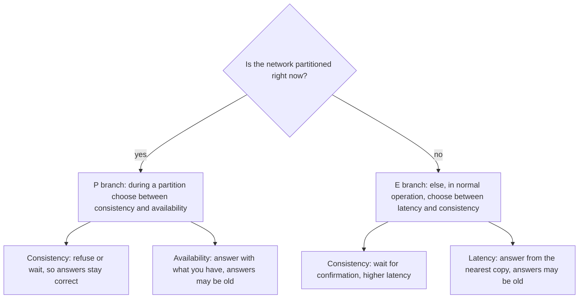

# Diagram sources, lesson 02

Each fenced block is the content of the .mmd file named above it.

**File: `partition-choice.mmd`**

```mermaid
sequenceDiagram
    autonumber
    participant W as Writer client
    participant A as Node A
    participant B as Node B
    participant R as Reader client
    Note over A,B: A network partition begins before the copy reaches B
    W->>A: write task status done
    A-->>W: accepted
    R->>B: read the task
    alt design chooses consistency
        B-->>R: error or timeout, B cannot confirm it has the latest value
    else design chooses availability
        B-->>R: answers with the last value it has, which may be old
    end
    Note over A,B: When the partition heals, B catches up from A
```

**File: `pacelc.mmd`**

```mermaid
flowchart TD
    P{"Is the network partitioned right now?"}
    PAC["P branch: during a partition choose between consistency and availability"]
    ELC["E branch: else, in normal operation, choose between latency and consistency"]
    C1["Consistency: refuse or wait, so answers stay correct"]
    A1["Availability: answer with what you have, answers may be old"]
    C2["Consistency: wait for confirmation, higher latency"]
    L2["Latency: answer from the nearest copy, answers may be old"]
    P -->|"yes"| PAC
    P -->|"no"| ELC
    PAC --> C1
    PAC --> A1
    ELC --> C2
    ELC --> L2
```
