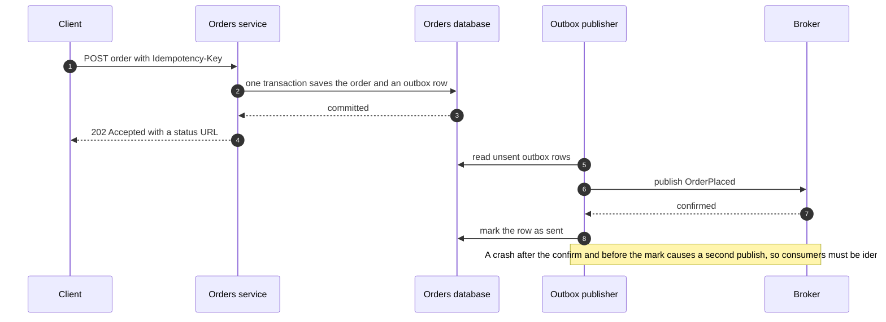
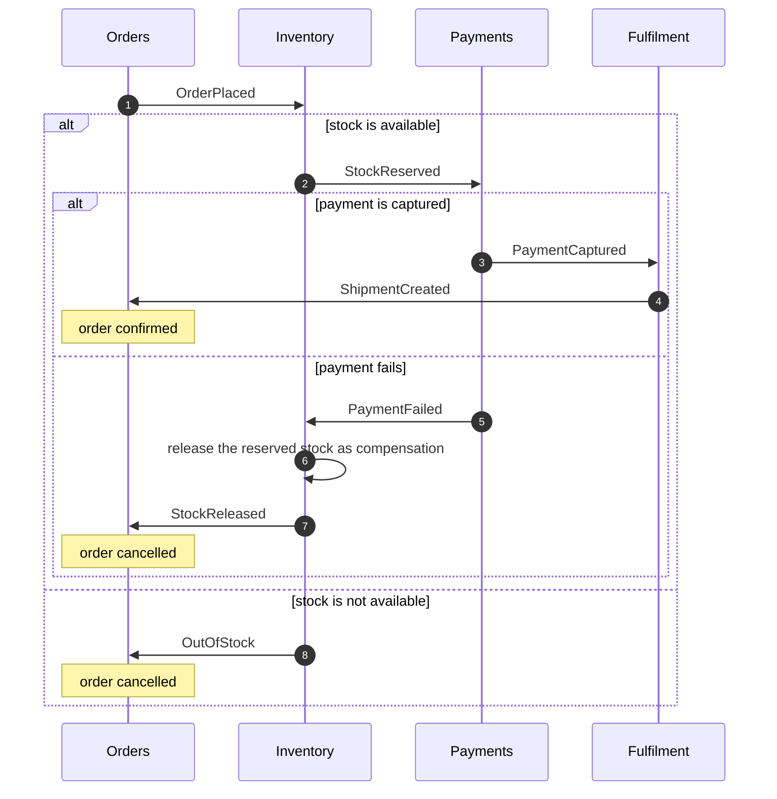
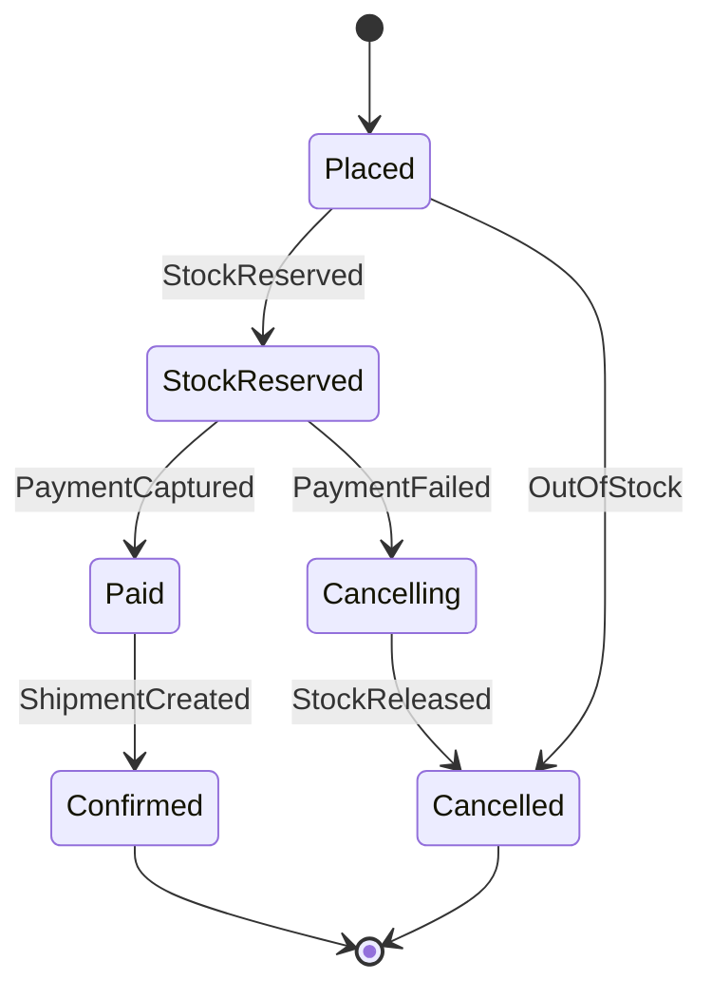

# Diagram sources, lesson 03

Each fenced block is the content of the .mmd file named above it.

**File: `outbox.mmd`**

```mermaid
sequenceDiagram
    autonumber
    participant C as Client
    participant O as Orders service
    participant D as Orders database
    participant P as Outbox publisher
    participant B as Broker
    C->>O: POST order with Idempotency-Key
    O->>D: one transaction saves the order and an outbox row
    D-->>O: committed
    O-->>C: 202 Accepted with a status URL
    P->>D: read unsent outbox rows
    P->>B: publish OrderPlaced
    B-->>P: confirmed
    P->>D: mark the row as sent
    Note over P,B: A crash after the confirm and before the mark causes a second publish, so consumers must be idempotent
```

**File: `order-saga.mmd`**

```mermaid
sequenceDiagram
    autonumber
    participant O as Orders
    participant I as Inventory
    participant P as Payments
    participant F as Fulfilment
    O->>I: OrderPlaced
    alt stock is available
        I->>P: StockReserved
        alt payment is captured
            P->>F: PaymentCaptured
            F->>O: ShipmentCreated
            Note over O: order confirmed
        else payment fails
            P->>I: PaymentFailed
            I->>I: release the reserved stock as compensation
            I->>O: StockReleased
            Note over O: order cancelled
        end
    else stock is not available
        I->>O: OutOfStock
        Note over O: order cancelled
    end
```

**File: `order-states.mmd`**

```mermaid
stateDiagram-v2
    [*] --> Placed
    Placed --> StockReserved : StockReserved
    Placed --> Cancelled : OutOfStock
    StockReserved --> Paid : PaymentCaptured
    StockReserved --> Cancelling : PaymentFailed
    Cancelling --> Cancelled : StockReleased
    Paid --> Confirmed : ShipmentCreated
    Confirmed --> [*]
    Cancelled --> [*]
```
