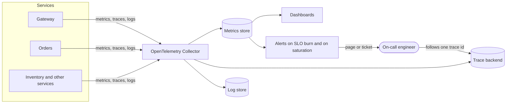
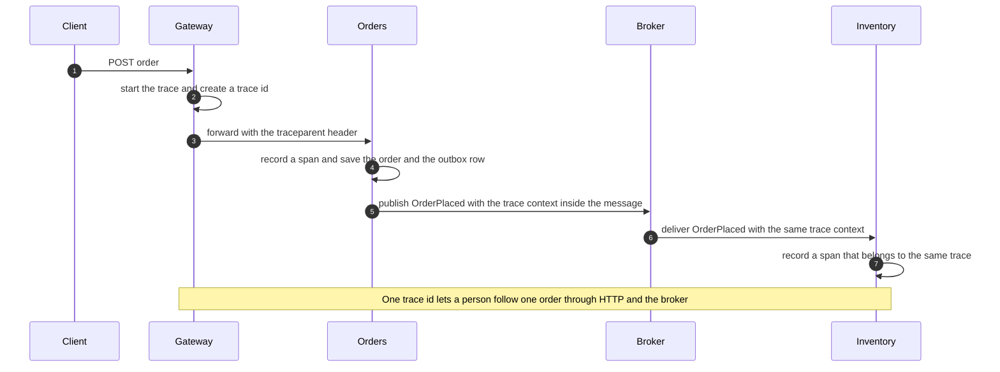

# Diagram sources, lesson 05

Each fenced block is the content of the .mmd file named above it.

**File: `telemetry-flow.mmd`**

```mermaid
flowchart LR
    subgraph svcs["Services"]
        s1["Gateway"]
        s2["Orders"]
        s3["Inventory and other services"]
    end
    col["OpenTelemetry Collector"]
    met[("Metrics store")]
    trc[("Trace backend")]
    log[("Log store")]
    dash["Dashboards"]
    alr["Alerts on SLO burn and on saturation"]
    oncall(["On-call engineer"])
    s1 -->|"metrics, traces, logs"| col
    s2 -->|"metrics, traces, logs"| col
    s3 -->|"metrics, traces, logs"| col
    col --> met
    col --> trc
    col --> log
    met --> dash
    met --> alr
    alr -->|"page or ticket"| oncall
    oncall -->|"follows one trace id"| trc
```

**File: `trace-propagation.mmd`**

```mermaid
sequenceDiagram
    autonumber
    participant C as Client
    participant G as Gateway
    participant O as Orders
    participant B as Broker
    participant I as Inventory
    C->>G: POST order
    G->>G: start the trace and create a trace id
    G->>O: forward with the traceparent header
    O->>O: record a span and save the order and the outbox row
    O->>B: publish OrderPlaced with the trace context inside the message
    B->>I: deliver OrderPlaced with the same trace context
    I->>I: record a span that belongs to the same trace
    Note over G,I: One trace id lets a person follow one order through HTTP and the broker
```
