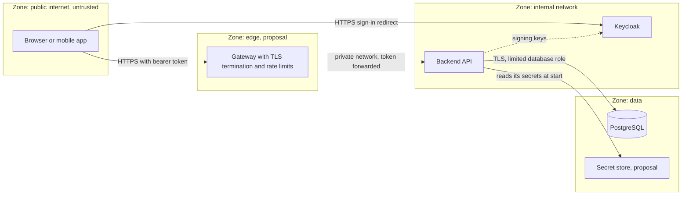

# Diagram sources, lesson 06

Each fenced block is the content of the .mmd file named above it.

**File: `trust-boundaries.mmd`**

```mermaid
flowchart LR
    subgraph internet["Zone: public internet, untrusted"]
        br["Browser or mobile app"]
    end
    subgraph edge["Zone: edge, proposal"]
        gw["Gateway with TLS termination and rate limits"]
    end
    subgraph internal["Zone: internal network"]
        api["Backend API"]
        kc["Keycloak"]
    end
    subgraph data["Zone: data"]
        db[("PostgreSQL")]
        sec["Secret store, proposal"]
    end
    br -->|"HTTPS with bearer token"| gw
    br -->|"HTTPS sign-in redirect"| kc
    gw -->|"private network, token forwarded"| api
    api -->|"TLS, limited database role"| db
    api -->|"reads its secrets at start"| sec
    api -.->|"signing keys"| kc
```
