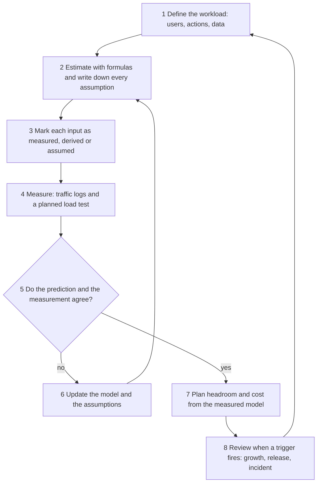

# Diagram sources, lesson 08

Each fenced block is the content of the .mmd file named above it.

**File: `capacity-process.mmd`**

```mermaid
flowchart TD
    A["1 Define the workload: users, actions, data"]
    B["2 Estimate with formulas and write down every assumption"]
    C["3 Mark each input as measured, derived or assumed"]
    D["4 Measure: traffic logs and a planned load test"]
    E{"5 Do the prediction and the measurement agree?"}
    F["6 Update the model and the assumptions"]
    G["7 Plan headroom and cost from the measured model"]
    H["8 Review when a trigger fires: growth, release, incident"]
    A --> B
    B --> C
    C --> D
    D --> E
    E -->|"no"| F
    F --> B
    E -->|"yes"| G
    G --> H
    H --> A
```
